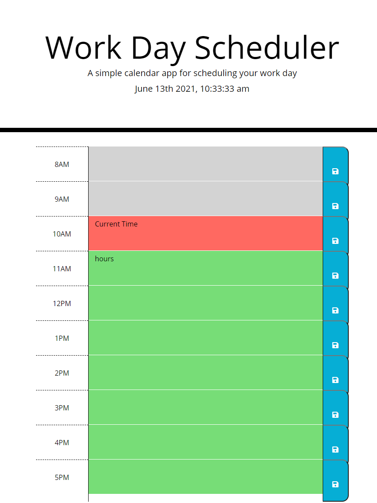

## Work Day Scheduler

## Purpose
This coding challenge required me to build a simple calendar application that allows a user to save events for each hour of the day. This app will run in the browser and feature dynamically updated HTML and CSS powered by jQuery.

## Website
https://janekv20.github.io/work-day-scheduler/

## Usage
* When users open up the application, the current date and time are displayed.
* Time blocks will display different colors: past(grey), current(red), and future(green).
* Users can write their item in the text area and hit the save button, items will store on local storage.
* If users refresh the application, their saved items will appear. 

## GitHub Repository
https://github.com/janekv20/work-day-scheduler

## Screenshots of Deployment

